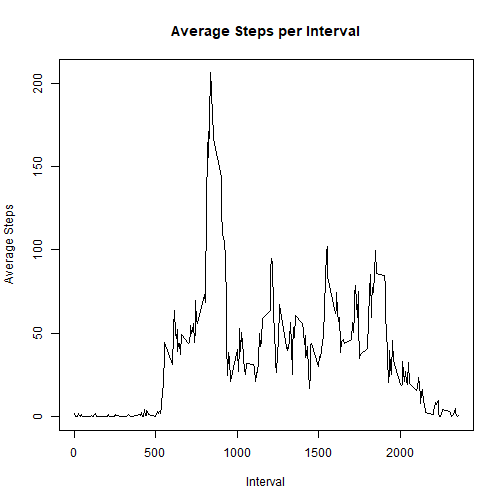
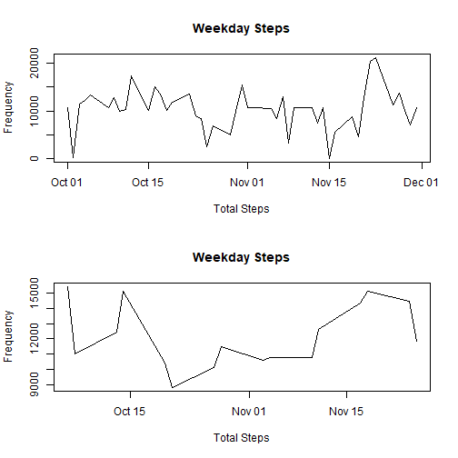

Section 1 (First Pass):


``` r
# import steps data
data <- read.csv("C:/Users/e182205/Downloads/repdata_data_activity/activity.csv", header = TRUE) 

# calculate total steps per day without correction
stepstotal <- aggregate(steps ~ date, data = data, FUN = function(x) sum(x, na.rm=TRUE))

# Plot the above as a histogram
hist(stepstotal$steps,
     main = "Total Steps per Day",
     xlab = "Total Steps",
     ylab = "Frequency")
```


``` r
# calculate mean and median steps per day, print those values
stepsmean <- mean(stepstotal$steps)
stepsmedian <- median(stepstotal$steps)

print(stepsmean)
```

```
## [1] 10766.19
```

``` r
print(stepsmedian)
```

```
## [1] 10765
```
Section 2 (Time Series):


``` r
# import steps data
data <- read.csv("C:/Users/e182205/Downloads/repdata_data_activity/activity.csv", header = TRUE) 

# calculate the average of the interval, including all days
stepsmean <- aggregate(steps ~ interval, data = data, FUN = function(x) mean(x, na.rm = TRUE))

# plot this average
plot(stepsmean$interval, stepsmean$steps,
     type = "l",
     main = "Average Steps per Interval",
     xlab = "Interval",
     ylab = "Average Steps")
```



``` r
# identify which interval has the maximum average
stepsmean_max <- stepsmean[which.max(stepsmean$steps), ]
print(stepsmean_max)
```

```
##     interval    steps
## 104      835 206.1698
```

Section 3 (Data Correction):


``` r
# import steps data
data <- read.csv("C:/Users/e182205/Downloads/repdata_data_activity/activity.csv", header = TRUE) 

# Replace NA with the mean of the interval
data$steps <- ifelse(
  is.na(data$steps),
  ave(data$steps, data$interval, FUN = function(x) mean(x, na.rm = TRUE))[is.na(data$steps)],
  data$steps
)

# Calculate the total steps per day with correction
stepstotal <- aggregate(steps ~ date, data = data, FUN = function(x) sum(x, na.rm=TRUE))

# Plot the above as a histogram
hist(stepstotal$steps,
     main = "Total Steps per Day",
     xlab = "Total Steps",
     ylab = "Frequency")
```


``` r
# calculate the mean and median total steps per day
stepsmean <- mean(stepstotal$steps)
stepsmedian <- median(stepstotal$steps)

print(stepsmean)
```

```
## [1] 10766.19
```

``` r
print(stepsmedian)
```

```
## [1] 10766.19
```

By replacing the NA values with the mean of the interval, we increase the chance that the median value will match the calculated mean. However, both values are still close to each other due to how they were calculated. If instead we replaced NA with 0 or with the mean per day instead of per interval, we'd likely see different values.

Section 4 (Weekday vs Weekend): 

``` r
# import steps data
data <- read.csv("C:/Users/e182205/Downloads/repdata_data_activity/activity.csv", header = TRUE) 

# Replace NA with the mean of the interval
data$steps <- ifelse(
  is.na(data$steps),
  ave(data$steps, data$interval, FUN = function(x) mean(x, na.rm = TRUE))[is.na(data$steps)],
  data$steps
)

# Convert date into date type
data$date <- as.Date(data$date)

# assign weekend and weekday values
data$daycat <- ifelse(weekdays(data$date) %in% c("Saturday", "Sunday"), "weekend", "weekday")
data$daycat <- factor(data$daycat, levels = c("weekday", "weekend"))

# Split the data to weekend and weekday
weekenddata <- subset(data, daycat == "weekend")
weekdaydata <- subset(data, daycat == "weekday")

weekendmean <- aggregate(steps ~ date, data = weekenddata, FUN = function(x) sum(x, na.rm=TRUE))
weekdaymean <- aggregate(steps ~ date, data = weekdaydata, FUN = function(x) sum(x, na.rm=TRUE))


# Create two panel layout and plot the two subsets in these panels
par(mfrow = c(2,1))

plot(weekdaymean$date, weekdaymean$steps,
      type = "l",
      main = "Weekday Steps",
      xlab = "Total Steps",
      ylab = "Frequency")

plot(weekendmean$date, weekendmean$steps,
     type = "l",
     main = "Weekday Steps",
     xlab = "Total Steps",
     ylab = "Frequency")
```




